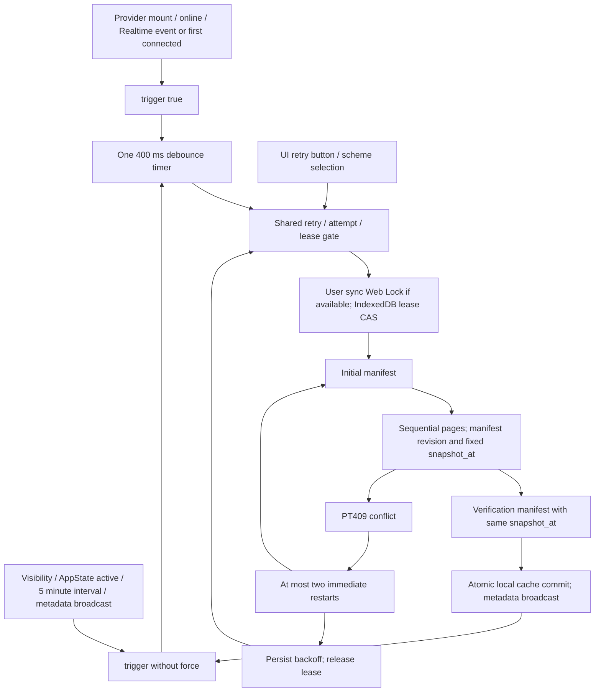

# Offline bootstrap storm — 2026-10-02

## Original runtime-capability defect

The previous runtime configuration expired in volatile memory after 60 seconds;
an offline reload could not fetch it again and disabled writes despite a prior
server confirmation. Confirmation now uses the existing cache `entries` store:
logical key `runtime:offline-capabilities`, physical key
`${user_id}:runtime:offline-capabilities`, cache-entry schema_version 1. Payload
is `{user_id,value:{write_enabled,sync_enabled,protocol_version:2,updated_at}|null,
fetched_at}`. IndexedDB remains **version 5**, with no redundant store or new
runtime-capability SQL migration.

The 60-second TTL schedules an online refresh; it does not discard confirmation
offline. Offline startup reads the durable snapshot, and only transport failure
can reuse it. 401/403, invalid JWT, business/malformed responses store a null
denial tombstone. Server false persists false; neither denial nor false can
resurrect an old true after reload. Build flags and current resource/role/session
checks remain mandatory: this snapshot grants no task access.

Reconnect refreshes server capability before outbox replay; `requireServer`
requires a fresh authorized response. All accesses are scoped to the active
user. Logout/account changes invalidate pending generations and volatile state;
retained durable entries follow existing per-user cache retention. Every
evaluation rereads storage; the existing sync-status BroadcastChannel announces
changes. CAS and full microsecond revision comparison prevent late responses
from overwriting a newer denial in another tab.

The browser scenario tests state, percentage and comment after offline hard
reload of a confirmation older than 60 seconds, another offline reload with all
three queued operations, reconnect, three stored receipts and empty outbox,
then cross-tab server false that blocks new writes and retains a queued operation.
No create/archive/member/ownership/template mutation was made offline-capable.

Actual browser build environment: `EXPO_PUBLIC_OFFLINE_WRITE_ENABLED=true`
(singular WRITE, the name read by this repository) and
`EXPO_PUBLIC_OFFLINE_SYNC_ENABLED=true`; Supabase URL/anon key point to the
guarded local stack, not linked. No `.env`/`.env.example` or cloud flag was edited.
Linked server runtime capabilities were verified enabled. Cloud build-environment
values could not be independently obtained from Vercel; local test injection is
not evidence of their current value.

## Root cause and evidence

The custom `SQLSTATE 40001` in `get_offline_account_page` was interpreted as a
serialization failure by PostgREST 14's transaction runner. Its retry loop did
not return control to the bounded JavaScript retry loop. A single HTTP request
could keep opening failing PostgreSQL transactions after the browser's timeout.
This matches [Supabase's documented PostgREST 14 defect](https://supabase.com/docs/guides/troubleshooting/high-cpu-and-infinite-transaction-retries-when-using-custom-error-codes-in-rpc-functions-77326b).

The revision does not have to keep changing: one initial mismatch is enough.
The server retries the same bound request with the same stale expected revision;
it never asks for a new manifest. The historical cause of that first mismatch
(a business mutation or moving time boundary) is not recorded in available logs.

Linked evidence, UTC on 2026-10-01:

| Window / event | Observation |
| --- | --- |
| 20:00–21:30 | 105,009 `offline snapshot changed` errors; only 146 edge log entries across all routes |
| 21:29–21:30 | 1,152 errors, all PID 155781, session `6abeb021.26085`, application `PostgREST 14.18`, SQLSTATE 40001 |
| Backend start | 19:10:25.289252; active page RPC, transaction/query start advanced approximately every 52 ms |
| Initial errors | 19:10:27.234, same PID |
| Closest originating request | Manifest 200 at 19:10:26.929, `https://tasktrace.ru/`, Windows Yandex, authenticated user `c035f3c5-fd5e-4b18-bf69-00b9713ad43d` |
| Same browser later | Manifest 200 at 19:11:17.593, three successful pages and verification at 19:11:18.125, while the earlier PID continued retrying |
| Mitigation | 21:36:49: exact PID + backend_start + authenticator + PostgREST + page-query guarded termination returned true |
| 21:37–21:47 | 0 snapshot errors, 0 manifest requests, 0 page requests over 10 minutes |

The backend loop is proven. The originating browser/account is a timing-based
attribution, because the hanging page request never produced a completed edge
response and its bound JSON parameters were absent from historical PostgreSQL
logs. The original dataset, offset, expected revision and actual revision cannot
be recovered from that evidence; they are **unknown**, not assumed to be history
or daily_audit. Windows Yandex was restarted after the loop started, while the
same server PID kept producing errors. Local smoke/backend runners enforce
127.0.0.1 API/DB URLs and do not account for the production origin in edge logs.

Local reproduction restores only the legacy local page function temporarily,
sends one stale `items`, offset 0 request and restores the exact current function
in `finally`. One HTTP request produced **803 DB errors**, one active
`PostgREST 14.5` backend after its 750 ms client timeout, and required guarded
backend termination. This is not performed against linked Supabase.

## Actual call graph

Before the fix, the page RPC's `RAISE 40001` went into a loop **inside
PostgREST**, before JavaScript could see an error, refresh a manifest or back off.
Frontend effects, Realtime callbacks and multi-tab queues were secondary
amplifiers, not evidence of 1,152 new HTTP requests per minute.

All production call sites:

- `bootstrap.ts`: `manifestFor` is the sole client manifest RPC; initial and
  final verification per attempt. The sequential page loop is the sole client
  page RPC. A changed final verification also consumes an immediate restart.
- `OfflineBootstrapProvider.tsx`: mount; online; Realtime rows in 11 tables;
  first connected transition; visibility; AppState active; five-minute interval;
  one retry timer; user metadata announcements without force.
- `offline-ready-indicator.tsx`: explicit retry button.
- `selectOfflineScheme`: cancels a superseded generation and waits for that
  module's existing runner before trying the new scheme.
- `SyncProvider` runs item push/pull, not account manifest/pages. Both engines
  use `tasktrace-sync:${userId}` to serialize confirmed cache changes.
- Direct bootstrap RPCs outside production code occur in SQL tests and the
  new HTTP integration runner. Browser scripts exercise the real provider.

Realtime routing was verified in the broadcast trigger: item invalidations go
to project/task topics; notification invalidations go to the user's topic.
Several names in the account provider's 11-table subscription have no user-topic
events; periodic revalidation covers those changes. The real burst test therefore
uses 50 notification updates with unread/read membership unchanged. Three-tab
startup revalidations are drained before its counters are reset. An online UI
write in the same browser context waits for the bootstrap's shared sync lock;
the controlled concurrent server write uses an independently signed-in browser
session, like a second device. Its actual manifest Response is delayed without
changing its data, then a normal checkbox mutation changes the item before pages.

## Protocol and deterministic revisions

New migration: `20261001214834_offline_bootstrap_stable_snapshots.sql`. The
already applied `20261001162836_account_offline_bootstrap.sql` is unchanged.
Old public/private signatures remain as compatible wrappers. New overloads add
`p_snapshot_at`; the manifest supplies an exact PostgreSQL timestamp. The client
preserves its microseconds verbatim and forwards it to every page and the final
manifest. Future timestamps reject with 22023; a context older than 30 minutes
rejects with PT409 and requires a new manifest.

| Datasets | Deterministic membership / serialization |
| --- | --- |
| profile, projects, members, profiles, tasks, overrides, assignees, items | Canonical jsonb of currently authorized rows; unique ID or composite row key; aggregate ordered by row key |
| roles | Current canonical `get_my_task_role`; no generated timestamp in row |
| templates, template_items | Canonical RPC rows; outer fingerprint/page order uses unique IDs rather than RPC output order |
| daily_audit | Fixed UTC+3 day_start through snapshot_at; day salt derives from that same snapshot |
| history | Fixed snapshot_at − 90 days through snapshot_at |
| notifications | Created no later than snapshot_at; all unread plus latest 100 read, deterministic created_at/id tie-break |
| last_editors | Canonical last-editor result, deterministic audit ordering; real mutations still change its revision |

`generated_at` is response metadata and is excluded from fingerprints. JSONB
key ordering, UTC serialization, sorted row hashes and page hashes are stable.
No bootstrap read mutates business rows. `ensure_profile` does not update an
existing profile; the two investigated linked profiles' updated_at values were
September 2/6, not the storm interval. A read-only check under the actual
authenticated role compared all 15 linked dataset revisions in five later,
separate transactions: **75 comparisons, 0 mismatches**.

Fixed time boundaries are a logical window, not an exported long-lived MVCC
snapshot. Mutable rows, deletion, notification state and access revocation
remain current. Page rows/revision/count materialize once in one transaction.
Real changes reject stale offsets; the client restarts within bounds, then
pauses under sustained churn. Revision checks are retained, including final
verification and page hashes. Reusing a stable window does not bypass RLS.

Conflict responses now use **PT409 / HTTP 409**, with DETAIL containing dataset,
offset, expected_revision, actual_revision and snapshot_at. Hashes are not shown
in the production UI. All bootstrap overloads remain SECURITY INVOKER, with
empty search_path and execute grants only for authenticated; public/anon/
service_role grants are revoked.

## Retry, ownership and events

- At most **3 total attempts** in one run: initial attempt + 2 immediate
  restarts for legacy 40001 or snapshot PT409.
- Durable user-scoped metadata stores failure count and next_retry_at.
  Exponential pause starts at 30 seconds, doubles, has ±20% jitter and a
  five-minute cap. Success clears it. Force, reconnect, visibility, connected,
  selection and another tab cannot reset that gate.
- A 30-second shared minimum between run starts coalesces successes/events too.
  Existing five-minute idle freshness remains.
- Web Locks use `ifAvailable`, so passive tabs do not queue duplicate forced
  work. A successful peer run can satisfy their queued event. The fallback
  IndexedDB lease is acquired/renewed via CAS; an expired owner cannot save,
  release or overwrite a replacement owner's lease. An already transmitted
  HTTP call cannot be retroactively withdrawn by a lease takeover.
- One debounce timer, one running callback, one interval. Repeated connected
  status is gated by a connection transition. Broadcast metadata never forces
  a server refresh. Cleanup removes listeners/timers/subscriptions and cancels
  the local generation; completion after unmount cannot reschedule polling.

## Smoke cleanup and validation

Shared `smoke-process-cleanup.mjs` always closes the browser session even if
offline reset fails, awaits the owned static-server child exit, escalates only
that child if necessary, and clears its timeout timers. Browser-close errors
fail the smoke instead of being silently ignored. Account smoke SDK clients
disable auto-refresh; DB/channels/config/fixtures clean up in finally. Both
browser smoke scripts use the helper. Local fixture audit identities are
retained according to the existing deletion contract.

Validation confirmed so far:

- `npm test`: PASS, 27 files / 233 tests, including typecheck/lint and capability
  revision comparison at PostgreSQL microsecond precision across time zones.
- Separate `npm run typecheck` and `npm run lint`: PASS.
- `npm run test:sql`: PASS, 11 local suites after local reset/migration.
- Expanded bootstrap SQL suite: PASS, 20 × 15 revision/page checks, time
  boundaries, diagnostic fields, future/expiry validation, all overload ACLs,
  current RLS and rejection of a previously authorized snapshot after revoke.
- Backend Data API/Auth/Realtime, GoTrue PKCE and two-session concurrency: PASS.
- `node scripts/run-bootstrap-integration-tests.mjs --reproduce-legacy`: PASS.
  After restoration: 150 stable HTTP pages over 10 rounds; one items mutation
  conflict (HTTP 409/PT409), fresh-manifest recovery HTTP 200. Fixed checks used
  12 manifests, 152 pages and 1 conflict; the additional legacy probe was 1 page.
  The final HTTP regression also inserts a row one microsecond inside a frozen
  90-day lower boundary and a row above the frozen upper boundary: separate HTTP
  calls retain the first and exclude the second for daily/history data.
- Retry regression: 100 forced calls → 3 manifests + 3 failing pages; a new
  module/tab cannot bypass the deadline; next eligible failure doubles backoff.
- Three independent Web Lock callers: one owner, two passive; fallback lease
  takeover prevents old-owner writes/release. 50 events coalesce; 100 reconnect/
  online/visibility/foreground signals preserve backoff. Unmount leaves no timer.
- Cleanup regression: failed offline reset still closes the browser; a real
  child HTTP/polling process exits and its port refuses connections.

The local production-browser idle windows completed: one tab ran 302.095 seconds
with 0 manifests / 0 pages; three tabs ran 306.597 seconds with 2 manifests /
0 pages. Fifty real notification invalidations then produced one shared refresh:
2 manifests / 0 pages. The first combined run subsequently failed the controlled
mutation test's precondition: an unchanged items batch was reused, and the real
mutation was caught by final verification rather than an HTTP page conflict.
The test now prepares a changed items batch to exercise the HTTP conflict path.
The corrected browser run observed one real `items`, offset 0 HTTP 409/PT409,
then exactly three manifests total (stale, refreshed, verified), three successful
replacement pages and readiness. The writer used the normal checkbox UI in a
separate browser session; no server response or authorization was fabricated.
`npm run smoke:offline:browser -- --storm-burst` subsequently completed with
exit 0, including all original offline read/write, reload, receipt, cross-tab
disable, scheme and history/notification checks. Its finally cleanup closed both
browser sessions and the owned server, removed project/template fixtures and
restored local runtime configuration. Process/port inspection found no remaining
test browser/server and no listener on port 4175.
Local results must not be represented as a deployment to linked.

The real account was logged in by the user in Codex's browser. `/projects`
reported ready before idle. One tab ran 22:19:44.245–22:26:12.557 UTC (388.312 s):
CDP observed 0 manifest/page requests with no event truncation. Linked logs for
the first complete 5 minutes (22:19:44–22:24:44) independently recorded 0 snapshot
errors, 0 manifests and 0 pages. Three authorized tabs then ran
22:26:51.321–22:32:08.010 (316.689 s): all three observed 0 manifest/page requests,
no event truncation. These measurements concern the existing deployed client.

The full linked window **22:19:44–22:32:08** lasted 12 minutes 24 seconds:
**0 snapshot errors, 0 SQLSTATE 40001, 4 manifests, 0 pages**. This includes the
two additional tab startups; aggregate rates are **0 errors/min,
0.323 manifests/min, 0 pages/min**. A subsequent pg_stat_activity check found
**0 active page-RPC backends**. All three temporary real-account tabs were then
closed and the Codex browser tab inventory was empty.

The final delivery checks reran `npm test` (27 files / 233 tests), separate
typecheck/lint, all 11 SQL suites and the complete `npm run test:backend` chain
after local reset. All passed. Backend checks include 150 stable separate HTTP
pages, frozen time boundaries, one PT409 and fresh-manifest recovery.
`npx expo export --platform all` passed for Android/iOS/Web (35 static routes);
`npm run build:web` passed and generated a service worker with 6 precached files.
Both build processes explicitly enabled WRITE/SYNC without editing env files.
Native export is not a physical-device smoke test; no such test was performed.
The local security advisor also passed (`No issues found`).

## Scope and remaining production verification

Phase scope (16 modified files and 6 new files before Git delivery):

- `src/lib/local-cache/runtime-config.ts`, `cache.ts`, `sync.ts`,
  `SyncProvider.tsx`, `src/features/auth/AuthProvider.tsx`: durable capability
  confirmation, session/denial/replay guards and exact revision comparison.
- `src/lib/local-cache/bootstrap.ts`, `bootstrap-types.ts`,
  `OfflineBootstrapProvider.tsx`: fixed time context, shared gates and events.
- `supabase/migrations/20261001214834_offline_bootstrap_stable_snapshots.sql`,
  `src/types/database.types.ts`: additive SQL protocol and regenerated local types.
- `scripts/account-offline-browser-smoke.mjs`, `phase6-browser-smoke.mjs`,
  `smoke-process-cleanup.mjs`, `run-bootstrap-integration-tests.mjs`,
  `package.json`: cleanup, HTTP reproduction/regression and real browser soak.
- `tests/offline-phase6-runtime.test.ts`, `offline-bootstrap.test.ts`,
  `offline-bootstrap-provider.test.tsx`, `smoke-process-cleanup.test.ts`,
  `supabase/tests/account_offline_bootstrap_test.sql`: regressions.
- `docs/offline-rollout.md`, `docs/offline-bootstrap-storm-investigation.md`:
  capability policy and this evidence/acceptance report.

The user subsequently authorized one commit and a normal push of the current
branch after validation. A manual deployment and linked migration application
remain outside that authorization. The only linked mutation was
the guarded operational termination of the identified hanging backend; schema,
RLS, business data and runtime flags were not changed. The new migration/client
are validated locally. Linked idle after termination can prove mitigation, but
cannot prove that an **undeployed** PT409 protocol prevents future incidents.
Permanent production acceptance requires applying this reviewed migration and
shipping the client, then repeating the real-account controlled mutation/burst
and idle measurements. Until that is authorized, production DONE is not claimed.
